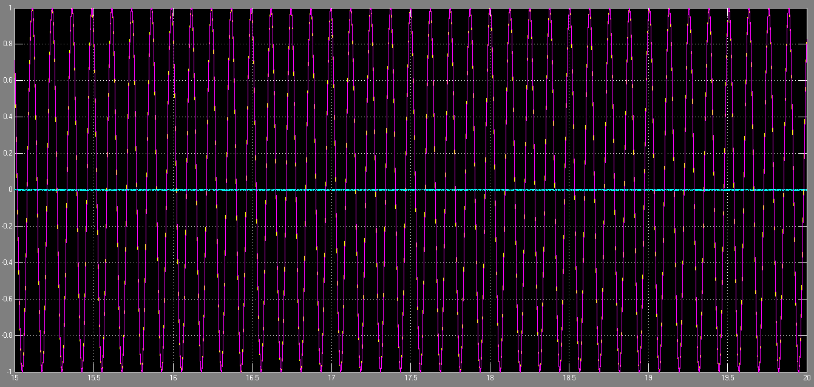

# Signal Processing — MATLAB, Simulink and Embedded DSP

MATLAB, Simulink and SHARC DSP exercises in filtering, sampling and signal analysis.



*Archived Simulink comparison of signal input, quantised output and error.*

## Modules

| Module | Content | Platform |
|---|---|---|
| [MATLAB signal processing](Traitement_Signal_MATLAB/) | Correlation, spectral analysis, filtering, interpolation, AM and simulated radar detection | MATLAB |
| [Sampling and quantisation](TP1_Quantification_du_son/) | Sampled signals, aliasing and quantisation coursework | Simulink |
| [SHARC IIR filter](DSP_SHARC_Filtre_IIR/) | Codec/SPORT/DMA processing chain and second-order IIR exercise | ADSP-21060, AD1847, C |

## Engineering progression

The MATLAB exercises explore signal properties and numerical algorithms. The Simulink work connects sampling choices with aliasing. The DSP exercise then exposes hardware integration: signed audio samples, serial-port frames, chained DMA and receive-interrupt processing.

This progression also highlights the difference between an algorithm's mathematical state and its lifetime in C memory. The corrected receive handler retains filter state across samples and evaluates one recurrence per incoming left-channel sample. Portable regression tests cover numerical response and the actual ISR history.

## Getting started

```bash
git clone https://github.com/tedjelmoulksn-dotcom/Traitement_du_Signal.git
cd Traitement_du_Signal
```

Follow the module READMEs for dependencies and entry points. MATLAB scripts may require Signal Processing Toolbox. The hardware scaffold requires the original board support and a compatible Analog Devices toolchain. The corrected filtering kernel and isolated ISR can be tested on a host with `make -C DSP_SHARC_Filtre_IIR test`.

## Validation and attribution

The technical thread is representation: time samples become correlation lags or spectral bins in MATLAB, then codec words and persistent filter state in C. The instructor scaffold supplies hardware services; the isolated handler identifies the student's algorithmic contribution.

The archive contains working reports and source fragments. The radar exercise uses simulated returns rather than hardware measurements. The SHARC program includes an instructor-provided scaffold; the student's contribution is explicitly identified in its module README.

The original reports retain their language and attribution and provide context for the implemented algorithms.

## Licence

No project-wide licence has been defined. Instructor and third-party material retains its original authorship.

