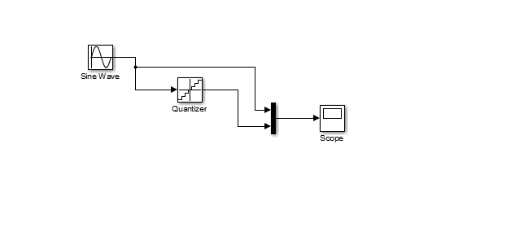

# Sampling and Quantisation — Simulink Laboratory

A simulated measurement chain illustrating sampling, spectral aliasing and quantisation error.

## Model and parameters

[`tp1_cdm.slx`](tp1_cdm.slx) contains the Simulink exercise. The initial sinusoid has angular frequency 50 rad/s. A coarse sampling period of 0.15 s is compared with `Te = 2*pi/1000 s`, corresponding to sampling angular frequency `we = 1000 rad/s`.

The exercise varies input angular frequency through 100, 250, 920, 1080, 1920 and 2080 rad/s to observe aliases.

## Sampling interpretation

The strict band-limit condition is `we > 2*wmax`. With `we = 1000 rad/s`, frequencies below 500 rad/s satisfy that inequality; equality is the boundary and does not provide robust reconstruction for arbitrary phase.

A 1080 rad/s sinusoid can appear at an 80 rad/s alias after sampling. Compare the sampled waveform with the lower-frequency reference rather than inferring the original frequency from samples alone.

## Quantisation study

The captures compare input, quantised output and error. Additional figures illustrate a sound example, but the original audio input is not included. The report does not provide a complete numerical error assessment.

## Reproducing

Open the model in MATLAB/Simulink, inspect generator periods and solver settings, run the simulation and inspect the Scopes. Supporting figures are in [`assets/`](assets/) and the working report is in [`docs/`](docs/).

## Validation and licence

Simulations were not rerun for this README update. No fresh quantisation accuracy or audio-quality values are reported. No project-wide licence has been defined.
