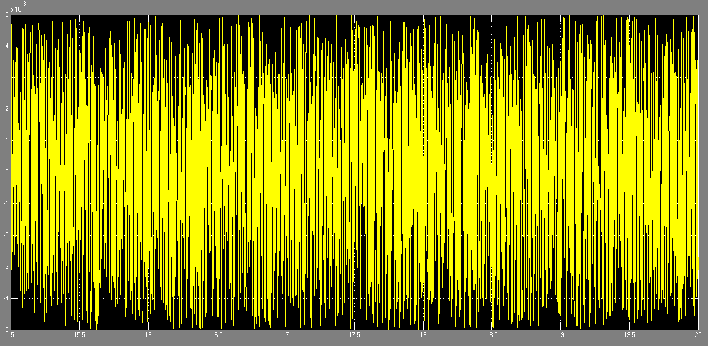

# Échantillonnage et quantification d'un signal sous Simulink

Simulation d'une chaîne de mesure numérique : échantillonnage d'une sinusoïde par un train d'impulsions, vérification du théorème de Shannon en faisant varier la pulsation du signal, puis quantification et observation de l'erreur, y compris sur un signal sonore.


## Vue d'ensemble

- **Cadre** : TP 1 « Électronique des chaînes de mesure », cycle ingénieur Instrumentation, Sup Galilée (Université Sorbonne Paris Nord), décembre 2024.
- **État** : TP terminé. Le compte rendu conservé est un brouillon non relu.

## Objectifs

Observer l'effet de la période d'échantillonnage sur la restitution d'un signal, repérer le repliement de spectre, puis mesurer l'erreur introduite par la quantification.

## Logiciel

MATLAB / Simulink (`tp1_cdm.slx`) : générateur de signal, générateur d'impulsions, oscilloscope (Scope).

## Implémentation

1. Sinusoïde de pulsation `w1 = 50 rad/s` échantillonnée par un générateur d'impulsions.
2. Premier réglage (20 impulsions pour 3 s, soit `Te = 0,15 s`) : échantillonnage insuffisant.
3. Réglage à 20 impulsions par période du signal : `Te = 2π/1000 s`, soit `we = 1000 rad/s`.
4. Variation de `w1` (100, 250, 920, 1080, 1920, 2080 rad/s) à `we` constant pour observer le repliement.
5. Quantification du signal, tracé de l'entrée, de la sortie et de l'erreur ; même chaîne appliquée à un son.

## Principes d'ingénierie

- **Théorème de Shannon** : `we > 2 × w1`. Avec `we = 1000 rad/s`, la condition est respectée jusqu'à `w1 = 500 rad/s`.
- **Repliement** : pour `w1 = 1080 rad/s`, le signal échantillonné se superpose à une sinusoïde de 80 rad/s (`1080 − 1000`) ; le compte rendu étudie aussi 920, 1920 et 2080 rad/s.
- **Quantification** : erreur entre le signal d'entrée et le signal quantifié, fonction du pas.

## Résultats

| Entrée, sortie et erreur de quantification | Erreur seule |
|---|---|
|  |  |

Les autres captures du dossier `assets/` montrent les oscillogrammes pour chaque réglage et la chaîne appliquée au son. Les valeurs numériques de l'erreur ne sont pas relevées dans le brouillon : **à documenter**.

## Difficultés et limites

- Compte rendu à l'état de brouillon (fautes de frappe, figures non légendées) : à reprendre avant toute publication.
- La partie « son » n'est décrite que par ses captures ; le fichier audio utilisé n'est pas joint.
- La simulation n'a pas été rejouée lors de la rédaction de cette documentation.

## Structure du dépôt

```
tp1_cdm.slx    Modèle Simulink
assets/        Captures des schémas et des oscillogrammes
docs/          Compte rendu (brouillon)
```

## Exécution

Ouvrir `tp1_cdm.slx` dans MATLAB/Simulink, régler la période du générateur d'impulsions, lancer la simulation et observer le Scope.

## Compétences démontrées

- Échantillonnage, critère de Shannon et repliement de spectre.
- Quantification et erreur associée.
- Modélisation d'une chaîne d'acquisition sous Simulink.

## Licence

Aucune licence n'a été définie.
