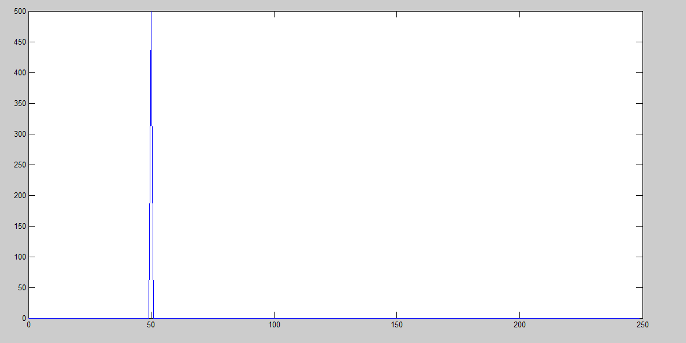
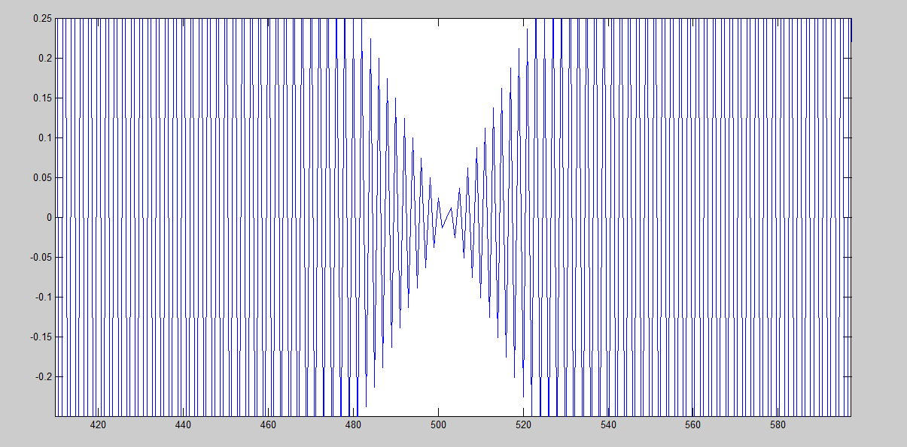
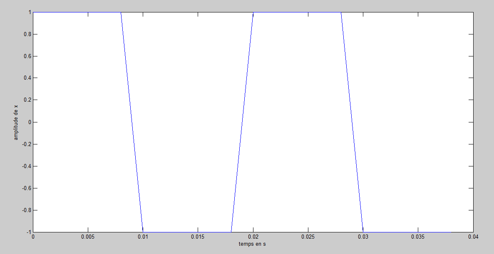
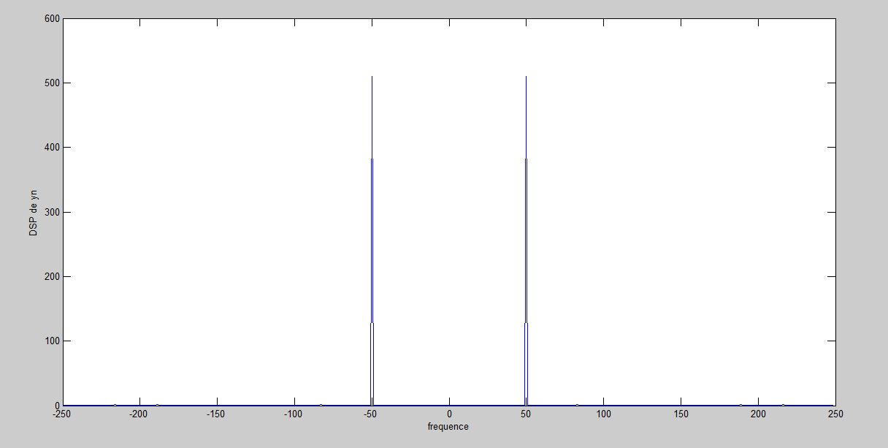

# Traitement du signal sous MATLAB

## Vue d'ensemble
Recueil de scripts MATLAB écrits pendant les travaux pratiques de traitement du signal (formation 2023–2026) : échantillonnage et quantification, analyse spectrale, corrélation, détection radar par intercorrélation, interpolation/suréchantillonnage, filtrage RIF, filtre RC et modulation d'amplitude.

## Objectifs
- Observer l'échantillonnage, le repliement spectral et l'erreur de quantification.
- Manipuler la FFT et la densité spectrale de puissance.
- Utiliser l'autocorrélation et l'intercorrélation pour extraire un signal du bruit.
- Comprendre l'interpolation de Shannon (sinc) et le suréchantillonnage par insertion de zéros.
- Caractériser des filtres (RIF simples, RC passe-bas) par leur réponse en fréquence.

## Architecture
Scripts indépendants, un par thème, dans `src/`.

| Script | Contenu |
|---|---|
| `autocorrelation_signal_bruite.m` | Sinus (a=2, f0=50 Hz, fe=500 Hz) + bruit blanc (σ²=5), autocorrélation `xcorr` sur L=40 retards |
| `dsp_et_filtrage_frequentiel.m` | FFT, `fftshift`, filtrage par masque fréquentiel de ±2 Hz autour de f0 |
| `densite_spectrale_puissance.m` | Estimation de la densité spectrale de puissance |
| `detection_radar_intercorrelation.m` | Motif sinus × gaussienne, 3 cibles (positions 50, 100, 200) dans un signal reçu de 300 échantillons bruité (σ²=0.2), détection par `xcorr(r,m)`, DSE par FFT |
| `interpolation_surechantillonnage_filtres_rif.m` | DSP (`semilogy`), interpolation sinc à t=1.3 (fenêtre ±10), insertion de zéros, filtres H1=[1 1] et H2=[1 2 1]/2, `freqz`, fréquence de coupure à −3 dB, `filter` |
| `convolution_signaux_rectangulaires.m` | Convolution de signaux rectangulaires |
| `spectre_signal_carre.m` | Spectre d'un signal carré (T0=20 ms, fe=500 Hz) |
| `filtre_rc_passe_bas.m` | Module de H(f) d'un RC passe-bas (R=1 kΩ, C=100 nF), \|H\|=1/√(1+(f/fc)²) |
| `modulation_amplitude.m` | Modulation AM (porteuse 10 kHz, message 1 kHz, m=1.5 → surmodulation) |

`docs/tp1_traitement_numerique_du_signal_compte_rendu.docx` : compte rendu du TP 1 (échantillonnage, condition de Shannon-Nyquist, quantification, DSP).

## Matériel
Aucun (simulation).

## Logiciel
MATLAB (Signal Processing Toolbox pour `xcorr`, `freqz`, `square`). Version utilisée : À documenter.

## Implémentation
Chaque script génère ses signaux, les traite et trace les résultats (`plot`, `stem`, `semilogy`).

## Principes d'ingénierie
- Lien temps/fréquence (FFT, DSP, théorème de Wiener-Khintchine).
- Condition de Shannon-Nyquist et repliement spectral.
- Gain en rapport signal/bruit par corrélation (filtrage adapté pour la détection radar).
- Interpolation idéale et filtres d'interpolation.

## Résultats
Captures dans `assets/` (voir Médias). Les autres figures se régénèrent en relançant les scripts.

## Difficultés / limites
- `interpolation_surechantillonnage_filtres_rif.m` charge `signalbase.mat`, fichier non disponible dans le dépôt.
- `convolution_signaux_rectangulaires.m` définit des fonctions locales avant le script : nécessite une version récente de MATLAB (ou de déplacer les fonctions en fin de fichier).
- Le compte rendu du TP 1 est une version de travail.

## Structure
```
Traitement_Signal_MATLAB/
├── README.md
├── .gitignore
├── src/      scripts .m
├── docs/     compte rendu du TP 1
└── assets/   captures
```

## Exécution
Ouvrir MATLAB dans `src/` puis lancer un script, par ex. `detection_radar_intercorrelation`.

## Médias
| DSP du signal échantillonné (TP 1) | Repliement spectral (TP 1) |
|---|---|
|  |  |

| Signal bruité | DSP | Signal filtré |
|---|---|---|
|  |  |  |

## Compétences
MATLAB, échantillonnage et quantification, FFT, densité spectrale, auto/intercorrélation, détection en présence de bruit, filtrage RIF, interpolation, modulation AM.
