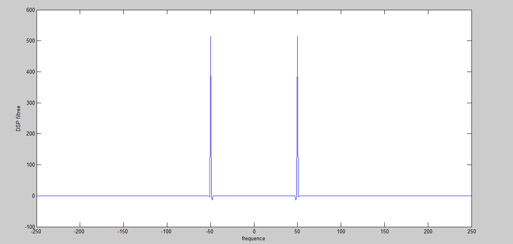

# MATLAB Signal Processing Exercises

Nine scripts exploring time-domain statistics, spectral representations, filtering and communication-style signals.

*Archived spectrum after frequency-domain filtering, showing components around ±50 Hz.*

## Script map

| Source | Focus |
|---|---|
| [Autocorrelation](src/autocorrelation_signal_bruite.m) | Noisy sinusoidal signal |
| [Power spectral density](src/densite_spectrale_puissance.m) | Spectral analysis |
| [Frequency filtering](src/dsp_et_filtrage_frequentiel.m) | FFT-domain selection |
| [Radar cross-correlation](src/detection_radar_intercorrelation.m) | Simulated delayed returns in noise |
| [Interpolation and FIR](src/interpolation_surechantillonnage_filtres_rif.m) | Sinc interpolation, zero insertion and simple FIR kernels |
| [Rectangular convolution](src/convolution_signaux_rectangulaires.m) | Discrete convolution |
| [Square-wave spectrum](src/spectre_signal_carre.m) | Harmonic structure |
| [RC low-pass](src/filtre_rc_passe_bas.m) | First-order frequency response |
| [Amplitude modulation](src/modulation_amplitude.m) | Carrier/message combination |

## Technical context

The autocorrelation example uses a 50 Hz sinusoid sampled at 500 Hz with added noise. The radar exercise uses simulated returns rather than a physical radar acquisition.

The RC study uses 1 kΩ and 100 nF, giving `fc = 1/(2*pi*R*C)`, approximately 1.59 kHz. The AM example uses a 10 kHz carrier, 1 kHz message and modulation index 1.5, illustrating overmodulation rather than standard envelope-detector operation.

## Running

Open MATLAB from this module and run the selected script. Signal Processing Toolbox is required by operations such as `xcorr`, `freqz` and `square`.

The interpolation script references `signalbase.mat`, which is not included. Supply a compatible input or construct an explicitly documented replacement. Check MATLAB release compatibility for local functions in the convolution script.

## Reproducibility

Random-noise experiments need a recorded seed for direct comparison. Spectral plots should identify sampling rate, FFT length, normalisation and frequency units. Correlation-based delay detection also needs a mapping from lag to physical range before being treated as an instrument measurement.

Use controlled input signals to interpret each algorithm: known delays for correlation, known tones for spectral selection and a documented modulation index for AM. This ties the output to the mechanism being exercised.

## Licence

No project-wide licence has been defined.
